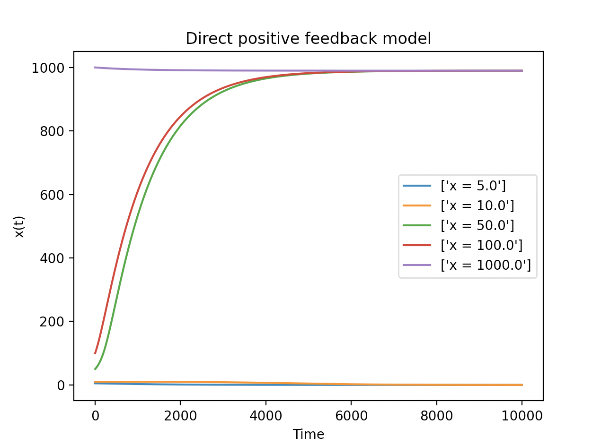
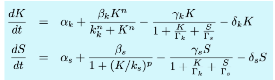

# CSB - GENE REGULATORY CIRCUITS
__Lilian Marie Boll__
June, 2021


## EXERCISE 1

### TASK
Consider a gene whose expression is affected by a direct positive feedback, with Hill coefficient 2, maximum expression rate 1 nM/s, activation threshold 100 nM, and degradation rate 0.001 s-1. Integrate the differential equation that represents the dynamics of the concentration of the expressed protein, and determine the threshold value of the initial condition that separates the basins of attraction of the two coexisting equilibrium states of the system.


### ANSWER
The differential expression for direct positive feedback was presented in class as the following:


Furthermore, we are given the following parameters:

  * Hill coefficient n = 2
  * Maximum expression rate b = 1
  * Activation threshold K = 100  
  * Degradation rate y = 0.001

We will plot different initial concentrations (x) and finally, to graphically
obtain the threshold of the initial state.

This will be done with the following python script.

```{python}
# Import the required modules
import numpy as num
from scipy.integrate import odeint
import matplotlib.pyplot as pyplot

# define fixed parameters
n = 2       # Hill coeff
b = 1       # max exp rate
K = 100     # act threshold
y
g = 0.001   # degrad rate

def diff_eq(x, t):
    """Function returning differential expression"""
    dxdt = ((b * x**n) / (K**n + x**n)) - g * x
    return dxdt

# set parameters for time and
t = num.linspace(0, 10000, 1000)
x0 = [5, 10, 50, 100, 1000]

pyplot.title('Direct positive feedback model')
pyplot.xlabel('Time')
pyplot.ylabel('x(t)')
#pyplot.legend(["x = %.0f nM" %x])

for x in x0:
    p0 = odeint(diff_eq, x, t)

    # get threshold value
    len_p0 = len(p0)
    print("The function for x =", x,"nM converges towards a value of", round(float(p0[len_p0-1]),4),"nM.")
    p1 = round(float(p0 [len_p0 - 1]), 3)

    # plot results using pyplot
    pyplot.plot(t, p0, label=["x = %.0f" %x])

  pyplot.legend()
  pyplot.show()
```


___Figure 1.1___: _Simulations of a direct positive feedback model for different values for x._


The table below presents the values the graphs converges towards for the given value of x.

| x    | x(t)    |
|------|---------|
| 5    | >0.001  |
| 10   | 0.0003  |
| 50   | 989.897 |
| 100  | 989.897 |
| 1000 | 989.898 |

The graph in figure 1.1 shows, that for x = 5 and x = 10, the curves behave very differently compared to higher values. This also reflects in the values the functions converge to. For values x≥50, we see it approaching a value of over 989, while the function for x≤10 approaches 0.These two values (around 0nM and 989nM) reflect the equilibrium states of our system.

We already now that the concentration threshold for the initial state seems to be between x=10nM and x=50nM. I tried different values, some presented in figure 1.2 below. It shows values between x=10 and x=11.


___Figure 1.2___: _Simulations of the direct positive feedback model for different values for x between 10 and 11 showing the two equilibrium states the system goes for._


From the plot in figure 1.2, we can conclude graphically, that the threshold of x for our system to enter in the other equilibrium state lies between 10.1nM and 10.2nM.

---
## EXERCISE 2

### TASK:
Consider the following activator-repressor model discussed in class (slide titled “From oscillations to pulses”):


Simulate this model for the following parameter values: a2=0.025 nM/s, b1=15 nM/s, b2=0.8 nM/s, d1=d2=5·10-5 s-1, g=2.5·10-7 nM-1s-1, K1=3000 nM, K2=750 nM, and n=m=2. Vary a1 as shown in the slides. Reproduce the dynamics obtained there.


### ANSWER
Again, we are provided with the model and fixed parameters. The python code below builds the model and simulates it for different values of a1. I used the three different values used in class (a1= 0.005, 0.007 and 0.01).

```{python}
# import from modules
import numpy as num
from scipy.integrate import odeint
import matplotlib.pyplot as pyplot

# define fixed parameters
a2 = 0.025
b1 = 15
b2 = 0.8
d = 5E-5
g =  2.5E-7
K1 = 3000
K2 = 750
n = 2

def diff_eq(p, t, a1):
    """Function returning the differential equation with given parameters"""
    x = p[0]
    y = p[1]
    dxdt = a1 + ((b1*(x**n)/((K1**n+x**n))))- g*x*y - d*x
    dydt = a2 + ((b2*(x**n))/((K2**n) + (x**n))) - d*y
    return[dxdt, dydt]

# set initial state parameters
p0 = [0, 100]
t = num.linspace(0, 2000000, 1000)

# study different values for a1
a1 = [0.005, 0.007, 0.01]

for a in a1:
    p1 = odeint(diff_eq, p0, t, args=(a,))
    x = p1[:,0]
    y = p1[:,1]
    # plot results using pyplot
    pyplot.title("Activator-Repressor Model with a1 = %.3f" %a)
    pyplot.xlabel("Time in s")
    pyplot.ylabel("Concentration in nM")
    pyplot.plot(t,x,label="activator")
    pyplot.plot(t,y, label="repressor")
    pyplot.legend()
    pyplot.show()
```

By changing the value for a1 (the basal expression) accordingly, we obtain the following three graphs presented in figure 2. For the first plot showing a value of a1=0.05, we observe the excitable state, where the cell enters the competent state. We observe no oscillation. With an increase of a1 to 0.05, we see that the system starts to oscillated, the state enters the oscillatory state. When increasing the basal expression a1 further, the system oscillates even faster which reflects in the number of pulses in the plots.


___Figure 2___: _Activator-Repressor Model for different values of a1._ Upper left: a1=0.005; upper-right a1=0.007; lower-left: a1=0.01.


---
## EXERCISE 3

### TASK:
The following model describes genetic competence in _B. subtilis_:



Simulate this model for the parameter values given in the table below:


Next, vary the parameters 𝛼k, 𝛼s and 𝛽s (one at a time) and study the response of the system in the different situations. Reproduce the different dynamical regimes studied in class.


### ANSWER
First, we will simulate the given model presented in the table above.
```{python}
# Import the required modules
import numpy as num
from scipy.integrate import odeint
import matplotlib.pyplot as pyplot

#define given parameters
a_k = 0.0875
a_s = 0.0004
b_k = 7.5
b_s = 0.06
g = 0.001
d = 0.0001
T_k = 25000
T_s = 20
k_k = 5000
k_s = 833
n = 2
p = 5


def diff_eq(p0, t, a_k, a_s, b_s):
    """Function returning the differential equation"""
    S = p0[1]
    K = p0[0]

    dKdt = (a_k+ ((b_k * K**n) / (k_k**n + K**n))) - ((g*K) / (1+(K/T_k) + (S/T_s))) - d*K
    dSdt = (a_s+ (b_s / (1 + (K/k_s)**p)))-((g*S) / (1+(K/T_k) + (S/T_s))) - d*S
    return [dKdt, dSdt]

# set initial state parameters
p0 = [1, 0]
t = num.linspace(0, 1000000, 1000)

# solve model
p1 = odeint(diff_eq, p0, t, args=(a_k, a_s, b_s))
dK = p1[:,0]
dS = p1[:,1]

# plot results using pyplot
pyplot.title(f'Model of genetic competence \n with a_k = {a_k}, a_s = {a_s}, b_s= {b_s}')
pyplot.xlabel('Time in s')
pyplot.ylabel('Concentration in nM')
pyplot.plot(t, dK)
pyplot.plot(t, dS)
pyplot.legend(["ComK", "ComS"])
pyplot.show()

# get values for K and S
len_dK = len(dK)
len_dS = len(dS)
print("[ComK] converges towards a value of ", round(float(dK[len_dK - 1]), 3))
print("[ComS] converges towards a value of ", round(float(dS[len_dS - 1]), 3))
```


___Figure 3.1___: _Simulations for default values._

`[[ComK] converges towards a value of  69.892

[ComS] converges towards a value of  413.255`

#### 1. Changing 𝛼k (basal expression rate of ComK, here a_k)

The following plots are obtained for increasing the basal expression rate of ComK (𝛼k) to different values:

`a_k=[0.018, 0.05, 0.0875, 0.3, 0.875, 2]`


___Figure 3.2___: _Simulations for different values of the basal expression rate of ComK (𝛼k=0.05, 0.0875, 0.1, 0.3, 0.875, 2)._

The concentration of ComS and ComK for the different values are presented in the table below.

| 𝛼k      | [ComK]   | [ComS] |
|---------|----------|--------|
| 0.00875 (default)| 2153.658 | 0.606  |
| 0.018    | 2998.088 | 0.47  |
| 0.05    | 2153.658 | 0.606  |
| 0.0875  | 966.31   | 57.738 |
| 0.3     | 1112.655 | 20.121 |
| 0.875   | 5548.956 | 0.448  |
| 2.0     | 9950.873 | 0.499  |

In the default state, presented in figure 3.1, there is no oscillation state and we see a much higher [ComS] than [ComK]. The first plot shows, that increasing 𝛼k will lead to some oscillation. With increasing 𝛼k, we keep seeing this oscillation but the concentration of ComK ends up converging at a higher level than ComS. This is, when we reach the theoretical state of constant competence. This matches what we have seen in class for the in vivo behaviour for the phenotypes when inducing expression of ComK and ComS with IPTG.


#### 2. Changing 𝛼s (basal expression rate of ComS, here a_s)

We will now start tweaking the value of the basal expression rate of ComS (𝛼s). The plots below present the graphs obtained with:

`a_s = [0.8, 0.858, 1, 4, 8, 80]`


___Figure 3.3___: _Simulations for different values of the basal expression rate of ComS (𝛼s=0.8, 0.858, 1, 4, 8, 80)._

The concentration of ComS and ComK for the different values are presented in the table below.

| 𝛼k      | [ComK]   | [ComS] |
|---------|----------|--------|
| 0.08    | 170.03 | 8400.266  |
| 0.858  | 14857.506   | 8662.151 |
| 1     | 73256.832  | 9801.591 |
| 4     | 74377.079 | 39800.399 |
| 8   | 74565.083 | 79800.199  |
| 80     | 74734.604 | 799800.02  |

This could be the bistable state reached at high values of αs, where one equilibrium point lies at higher comS concentrations, and the other at high comK concentrations.

We can see that increasing αs from our default value 0.0004 to 0.08, the concentration of ComS increases significantly too. While in Figure 3.1 (default values), we reach a plateau around 400 nM, with αs=0.08 this plateau lies at over 8000 nM. However, again we can reach a point where the expression of ComK exceeds ComS by far (around αs=0.086). This leads the system to another bistable point of perpetual competence. By increasing αs even further, we observe a high expression of ComS that reverts this situation again. If the basal expression of ComS is extremely high, we will reach a similar state to our default values where [ComS] is higher than [ComK] only that the concentration of ComS is now extremely high compared to the default state.


#### 3. Changing 𝛽s (increasing stress rate, here b_s)

Last but not least, we will expose our system to different levels of stress.
Below are presented the plots for the following values:

`bs_list = [0.06, 0.915, 0.918, 1, 2, 8]`


___Figure 3.4___: _Simulations for different values of the stress (𝛽s=0.06, 0.915, 0.918, 1, 2, 8)._

The concentration of ComS and ComK for the different values are presented in the table below.

| 𝛼k      | [ComK]   :| [ComS] :|
|---------|----------|--------|
| 0.06  | 69.892 |  413.255  |
|  0.915 |  359.079  | 8888.88 |
|   0.918   |  17410.122 | 3897.677 |
|   1   | 2407.913 | 2.675 |
|  2  | 2004.643 | 30.337  |
|   8   | 3403.644 |  10.592 |

We can see that increasing the 𝛽s to 0.06 does not change the system much compared to the  default state presented in Figure 3.1 where ComK is more abundant than ComS. However, when we increase the stress to a value around 1, we can see that the expression of ComS increases to then be highly repressed. At the same time, ComK excitedly bypasses ComS to then enters in a state of oscillation. We reach an equilibrium where ComK is higher than ComS (in contrast to our default state where ComS was significantly higher than ComK).
Finally, we can observe that when increasing the stress even more (𝛽s=8), the expression of ComS exceeds the one of ComK again. This is where we can find another stable point of constant competence. In vivo, this point would not be reached, as the cell would probably sporulate before this.
